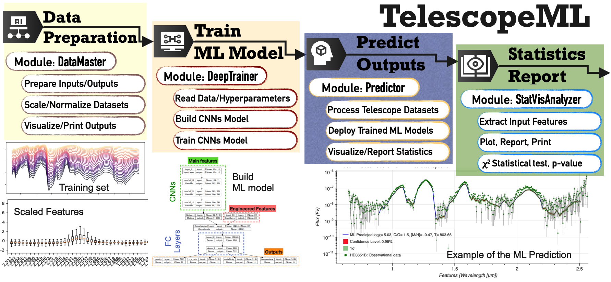

# TelescopeML

``TelescopeML`` is a Python package comprising a series of modules, each equipped with specialized machine learning and
statistical capabilities for conducting Convolutional Neural Networks (CNN) or Machine Learning (ML) training on
datasets captured from the atmospheres of extrasolar planets and brown dwarfs. The tasks executed by the ``TelescopeML``
modules are outlined below:

- *DataMaster module*: Performs various tasks to process the datasets, including:

    - Preparing inputs and outputs
    - Splitting the dataset into training, validation, and test sets
    - Scaling/normalizing the data
    - Visualizing the data
    - Conducting feature engineering

- *DeepTrainer module*: Utilizes different methods/packages such as TensorFlow to:

  - Build Convolutional Neural Networks (CNNs) model using the training examples
  - Utilize tuned hyperparameters
  - Fit/train the ML models
  - Visualize the loss and training history, as well as the trained model's performance

- *Predictor module*: Implements the following tasks to predict atmospheric parameters:

  - Processes and predicts the observational datasets
  - Deploys the trained ML/CNNs model to predict atmospheric parameters
  - Visualizes the processed observational dataset and the uncertainty in the predicted results

- *StatVisAnalyzer module*: Provides a set of functions to perform the following tasks:

  - Explores and processes the synthetic datasets
  - Performs the chi-square test to evaluate the similarity between two datasets
  - Calculates confidence intervals and standard errors
  - Functions to visualize the datasets, including scatter plots, histograms, boxplots

or simply...

 - Load the trained CNN models
 - Follow the tutorials
 - Predict the stellar/exoplanetary parameters
 - Report the statistical analysis

## Documentation

- Documentation: https://ehsangharibnezhad.github.io/TelescopeML/
- Installation: https://ehsangharibnezhad.github.io/TelescopeML/installation.html
- Tutorials: https://ehsangharibnezhad.github.io/TelescopeML/tutorials.html
- The code: https://ehsangharibnezhad.github.io/TelescopeML/code.html

## Contributors

<!-- ALL-CONTRIBUTORS-BADGE:START - Do not remove or modify this section -->

<!-- ALL-CONTRIBUTORS-BADGE:END -->

Thanks goes to these wonderful people ([emoji key](https://allcontributors.org/docs/en/emoji-key)):
<!-- ALL-CONTRIBUTORS-LIST:START - Do not remove or modify this section -->
<!-- prettier-ignore-start -->
<!-- markdownlint-disable -->

<table>
  <tbody>
    <tr>
      <td align="center" valign="top" width="20%">
        <a href="https://github.com/EhsanGharibNezhad">
           
          <b>Ehsan Gharib-Nezhad</b>
        </a> 
        <a href="https://github.com/EhsanGharibNezhad/TelescopeML/commits?author=EhsanGharibNezhad" title="Code">💻</a> 
        <a href="#ideas" title="Ideas, Leading ">🤔</a>
        <a href="https://pypi.org/project/TelescopeML/" title="Maintenance">🚧</a>
        <a href="https://ehsangharibnezhad.github.io/TelescopeML/tutorials.html" title="tutorial">📚</a>
      </td>
      <td align="center" valign="top" width="20%">
        <a href="http://natashabatalha.github.io">
           
          <b>Natasha Batalha</b>
        </a> 
        <a href="#mentoring-astro" title="mentoring">🧑‍🏫</a> 
        <a href="https://github.com/EhsanGharibNezhad/TelescopeML/commits?author=natashabatalha" title="bug">🐛</a>
        <a href="#ideas" title="Ideas & Feedback">🤔</a>
      </td>
      <td align="center" valign="top" width="20%">
        <a href="https://github.com/hvalizad">
           
          <b>Hamed Valizadegan</b>
        </a> 
        <a href="#mentoring-ML" title="mentoring">🧑‍🏫</a> 
        <a href="#ideas" title="Ideas & Feedback">🤔</a>
      </td>
      <td align="center" valign="top" width="20%">
        <a href="https://github.com/migmartinho">
           
          <b>Miguel Martinho</b>
        </a> 
        <a href="" title="mentoring-CNNTuning-BOHB" title="Mentoring">🧑‍🏫</a>
        <a href="#ideas" title="Ideas & Feedback">🤔</a>
      </td>
      <td align="center" valign="top" width="20%">
        <a href="https://github.com/letgotopal">
           
          <b>Gopal Nookula</b>
        </a> 
        <a href="https://ehsangharibnezhad.github.io/TelescopeML/tutorials.html" title="tutorial">📚</a>
      </td>
    </tr>
  </tbody>
</table>

<!-- ALL-CONTRIBUTORS-LIST:END -->