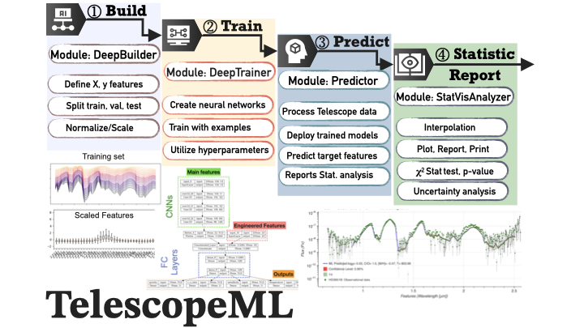

---
title: '`TelescopeML` -- I. Convolutional Neural Networks and Machine Learning Python Package for Analyzing  
Stellar and Exoplanetary Telescope Spectra'
tags:
  - Python
  - Astronomy
  - Exoplanets
  - Brown dwarfs
  - Spectroscopy
  - Atmospheric retrieval
  - Atmospheric models
  - Machine learning
  - Convolutional Neural Network
  - Telescope datasets
authors:
  - name: Ehsan (Sam) Gharib-Nezhad
    orcid: 0000-0002-4088-7262
    affiliation: "1, 2"
  - name: Natasha E. Batalha
    orcid: 0000-0003-1240-6844 
    affiliation: "1"
  - name: Hamed Valizadegan
    orcid: 0000-0001-6732-0840
    affiliation: "3, 4"
  - name: Miguel J. S. Martinho
    orcid: 0000-0002-2188-0807
    affiliation: "3, 4"
  - name: Gopal Nookula 
    orcid: (Ask Gopal to fix this!)
    affiliation: "5"
affiliations:
  - name: Space Science and Astrobiology Division, NASA Ames Research Center, Moffett Field, CA, 94035 USA
    index: 1
  - name: Bay Area Environmental Research Institute, NASA Research Park, Moffett Field, CA 94035, USA
    index: 2
  - name: Universities Space Research Association (USRA), Mountain View, CA 94043, USA
    index: 3
  - name: Intelligent Systems Division, NASA Ames Research Center, Moffett Field, CA 94035, USA
    index: 4
  - name: (Hey Gopal- please complete this) University of California, Riverside
    index: 5

date: 01 November 2023
bibliography: paper.bib

aas-doi: LINK OF ApJ PAPER
aas-journal: The Astrophysical Journal 

--- 

# Statement of Need

We are on the verge of a revolutionary era in space exploration, thanks to advancements in ground- and space-based 
telescopes, such as the James Webb. These remarkable instruments collect an enormous amount of data from extrasolar 
atmospheres [e.g., @bean2018transiting]. Without an accurate interpretation of this data, the main objectives 
of space missions will not be fully accomplished. Different analytical and statistical methods, such as the chi-test and 
Bayesian statistics, and packages have been developed [e.g., @batalha2017pandexo; @batalha2019picaso; @MacDonald2023POSEIDON]
and are utilized in the context of forward- and retrieval-radiative transfer modeling to interpret these datasets and 
extract crucial information, such as atmospheric temperature, metallicity, carbon-to-oxygen ratio, and surface gravity 
[e.g., see @Marley2015; @line2014systematic; @Iyer2023Sphinx]. These atmospheric models rely on the synthetic training 
datasets generated by simulating the physics and chemistry of these atmospheres for a wide range of thermal structures 
and compositions. In addition, different machine learning and deep learning methods have been developed in recent years 
to perform various tasks, such as confirming the detection of exoplanets [e.g., @Valizadegan2021 by implementing CNN 
techniques] and brown dwarfs [e.g., @Lueber2023RandomForesr_BDs using Random Forest ensembles]. However, to the best of
our knowledge, this is the first time, deep learning and convolutional neural networks is implemented on brown dwarf 
atmospheric datasets to predict parameters such as temperature and gravity simultaneously.  

With the continuous observation of these objects and the increasing amount of data coming to Earth each day, there is a 
critical need for a systematic pipeline to explore the datasets and extract important information from them. This 
invaluable information will be utilized to provide insights about the diversity of exoplanets and brown dwarfs' 
atmospheric compositions and will help facilitate the long-term analysis of this data in research. `TelescopeML`
is an ML Python package with Sphinx-ed user-friendly documentation that provides both trained ML models and ML tools 
for interpreting observational data captured by telescopes.

# Functionality and Key Features
`TelescopeML` is a Python package comprising a series of modules, each equipped with specialized machine learning and 
statistical capabilities for conducting Convolutional Neural Networks (CNN) or Machine Learning (ML) training on datasets 
captured from the atmospheres of extrasolar planets and brown dwarfs. The tasks executed by the `TelescopeML` modules are 
outlined below and visualized in Figure \autoref{fig:TelescopeML_modules}:

- **StatVisAnalyzer module**: Explore and process the synthetic datasets (or the training examples) and provide functions for statistical analysis.
- **DeepBuilder module**: Specify training and target features, normalize/scale datasets, and pass them to the ML training phase.
- **DeepTrainer module**: Create an ML model, train the model with the training examples, and utilize hyperparameters.
- **Predictor module**: Process the observational datasets and deploy the trained ML model to predict atmospheric parameters such as gravity and temperature.

{height="15pt"}

# Documentation

`TelescopeML` is available and being maintained as a GitHub repository at
[github.com/EhsanGharibNezhad/TelescopeML](https://github.com/EhsanGharibNezhad/TelescopeML). Online 
documentation is hosted with _Sphinx_ using _ReadtheDocs_ tools and includes several instructions and tutorials 
as follows: 

- **Main page**: https://ehsangharibnezhad.github.io/TelescopeML/
- **Installation**: https://ehsangharibnezhad.github.io/TelescopeML/installation.html
- **Tutorials and examples**: https://ehsangharibnezhad.github.io/TelescopeML/tutorials.html
- **The code**: https://ehsangharibnezhad.github.io/TelescopeML/code.html
- **ML Concepts**: https://ehsangharibnezhad.github.io/TelescopeML/knowledgebase.html

#  Users  and Future Developments

Astrophysicists with no prior machine learning knowledge can deploy the `TelescopeML` package and download the 
pre-trained ML or CNN models to interpret their observational data. In this scenario, pre-trained ML models, 
as well as the PyPI package, can be installed and deployed following the online instructions. Tutorials in the 
Sphinx documentation include examples for testing the code and also serve as a starting point. For this purpose, 
a basic knowledge of Python programming is required to install the code, run the tutorials, deploy the modules, 
and extract astronomical features from the datasets. The necessary machine learning background and a detailed 
guide for package installation, along with links to further Python details, are provided to help understand 
the steps and outputs.

Astrophysicists with machine learning expertise and data scientists can also benefit from this package by 
developing and fine-tuning the modules and pre-trained models to accommodate more complex datasets from 
various telescopes. This effort could also involve the utilization of new ML and deep learning algorithms, 
adding new capabilities such as feature engineering methods, and further optimization of hyperparameters 
using different and more efficient statistical techniques. The ultimate outcome from these two groups would 
be the creation of more advanced models with higher performance and robustness, as well as the extension of 
the package to apply to a wider range of telescope datasets.

# Acknowledgements
Ask the team if they want to acknowledge any grant!!!! 
Ask Natasha for the Grant!!
Ask Janet for Gopal's summer support from NASA!!
E. Gharib-Nezhad expresses gratitude to the developers of many open source Python packages used by `TelescopeML`, ...

# References
